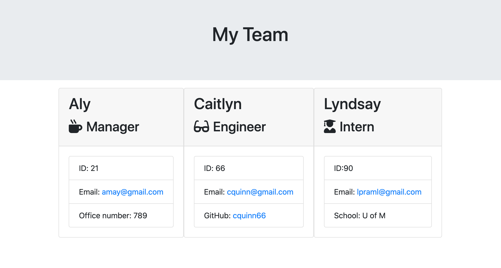

# Team-Profile-Generator

This is a Node.js command-line application that prompts users to submit information about employees on a software engineering team. It then in return generates an HTML webpage that displays a summary for each person, including their name, ID, email and other info depending on their role.

<strong>Video Link:</strong>https://drive.google.com/file/d/1ZRMWBGBrCQEx-_8jlq45BrxeGA29VfET/view?usp=sharing
 
<strong>Repo Link:</strong>https://github.com/amay1421/Team-Profile-Generator

